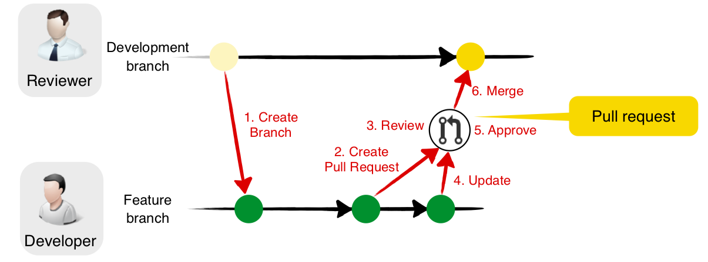

# Caper Web Assignment

## Installation
Using Terminal

`git clone https://github.com/maxiaolin9495/caper_assignment`

## Run the Example

we strongly recommend you to use docker \
Firstly you need to build the docker images in your local path

`docker-compose build`

Then you can start the whole project with:

`docker-compose up -d`

`-d` runs container in detached mode (in the background)

To stop the docker containers, simply use `docker-compose down`

#### Git Workflow
Please use feature branches only to commit your code. 

After finishing your feature, create a pull request and add one reviewer.

The reviewer needs to make sure the features committed are working without errors before approving.

The reviewer shall merge the feature branch into the develop branch once they approved the pull request.

The master branch is only used for production, i.e. a finished deliverable/ work product.

##### Here is our workflow:

Reference: Copyright 2019 Stephan Krusche, Bernd Bruegge - POM SS19 - 09 - Branch and Merge Management - Slide 7

#### Naming Branches
Name the branches according to the branch types:
- 👨‍🎨 **Feature**: `feature/xx-yy-zz` -- ease tracking of features. Example: `feature/add-free-slots`
- 🧙‍♀️**Bugfix**: `bugfix/xx-yy-zz` -- fixed bugs.
- 👶 **Minor**: `minor/xx-yy-zz` -- refactorings or something similar.

#### Commit messages
Write commit messages based on these [guidelines](https://chris.beams.io/posts/git-commit/) ❤
